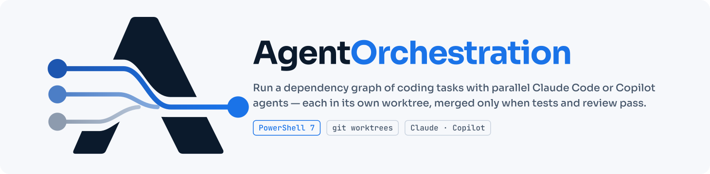

<p align="center">
  
</p>

# Agent Orchestrator: Design & Usage

A small PowerShell harness that runs a dependency graph of coding tasks with parallel
Claude Code or GitHub Copilot CLI headless agents. Each agent works in its own git worktree,
and only work that passes tests and a review agent is merged. Requires PowerShell 7, git,
and the selected provider's CLI. Use `-Provider Claude` or `-Provider Copilot` on every
agent-running script; the same task plan works with either provider.

```
/write-spec ──► spec.md ──► Plan-Tasks.ps1 ─────────────────────► .orchestrator/tasks.json ──► (you review) ──► Invoke-Orchestrator.ps1 ──► orch/integration ──► (you merge) ──► Complete-Orchestrator.ps1
 interview                  skeleton (new repo) + planner agent    task graph                                    parallel workers + gates                                         archive the run
```

- [At a glance](#at-a-glance)
- [From idea to finished application](#from-idea-to-finished-application)
- [The task file](#the-task-file)
- [Writing a spec](#writing-a-spec)
- [Planning](#planning)
- [Scheduling](#scheduling)
- [Gates and merging](#gates-and-merging)
- [Files and state on disk](#files-and-state-on-disk)
- [Command reference](#command-reference)
- [Agent permissions and safety](#agent-permissions-and-safety)
- [Limits and known gaps](#limits-and-known-gaps)
- [Where the design comes from](#where-the-design-comes-from)

## At a glance

A planner agent turns a spec into tasks with dependencies. The scheduler runs every task
whose dependencies are merged, several at once, each in a fresh worktree. A task is merged
only after it passes its own checks, and each merge unblocks the tasks that depend on it.

```
                    ┌──────────────────────────── scheduler loop (Invoke-Orchestrator.ps1) ───────────────────────────┐
                    │  ready = pending + all deps done + owns don't overlap a running task, up to -MaxParallel         │
                    │  order: re-sync tasks first, then tasks with the most dependents (critical path)                │
                    └───────────────┬──────────────────────────────────────────────┬───────────────────────────────────┘
                                    │ one thread job per task                      │
                                    ▼                                              ▼
 ../<repo>.worktrees/<id>   branch orch/task/<id>, cut from orch/integration   (same for every other running task)
    1 worker agent  ──►  2 commit  ──►  3 owns check  ──►  4 merge orch/integration in  ──►  5 acceptance  ──►  6 review agent
         ▲                                                   (resolver agent on conflict)     command          (2 verdicts)
         │                                                                                                          │
         └──────────── any gate fails: feedback goes back to the same worker session (--resume), up to maxAttempts ─┘
                                                                                                                    │ pass
                                                                                                                    ▼
 orch/integration  ◄── merge --no-ff (single writer)  ──►  optional integrationCheck (merge undone if it fails)  ──►  dependents unblock
```

## From idea to finished application

This walkthrough builds an application in a new repo, `C:\src\myapp`, with this repo
checked out at `C:\Data\AgentOrchestration`. Replace both paths with your own.

You do three things by hand: answer the spec interview, look over the plan and merge the
result. Creating the repo, the project skeleton, the plan and the code is automated.

**Where the work happens.** Every step says which of these three places to use:

| Place | What it is | How to open it |
| --- | --- | --- |
| **Terminal** | PowerShell 7 (`pwsh`), not Windows PowerShell 5.1 | Windows Terminal with the *PowerShell* profile, or in VS Code **Terminal → New Terminal**. Check with `$PSVersionTable.PSVersion` (7.2 or later). |
| **Agent chat** | Claude Code or Copilot, interactive, started in the `AgentOrchestration` folder. Both can discover the shared `/write-spec` and `/plan-tasks` skills in `.claude/skills`. | Open this folder in VS Code and use Claude Code or GitHub Copilot chat; or start `claude` or `copilot` in a terminal. |
| **Editor** | VS Code, for reading and editing files | **File → Open File…** or **File → Open Folder…** |

Orchestrator commands in the terminal steps assume the current folder is
`C:\Data\AgentOrchestration`.

### Step 0: One-time setup

1. **Install** PowerShell 7.2+, git 2.20+, and the Claude Code or Copilot CLI you intend to use.
2. **Log in** to the selected CLI (`claude` or `copilot login`). Scripts that run agents require `-Provider`
    and resolve `-AgentPath`, then `ORCH_CLAUDE` / `ORCH_COPILOT`, then the standalone
    executable on PATH, then the VS Code extension-managed install (Claude extension binary
    or Copilot CLI under VS Code globalStorage). You may install and use both at once.
3. **Get this repo** (terminal):
   ```powershell
   git clone https://github.com/fuzz74/AgentOrchestration C:\Data\AgentOrchestration
   cd C:\Data\AgentOrchestration
   ```
4. **Check that it works, without spending tokens** (terminal): run `.\tests\Run-SmokeTest.ps1 -Provider Claude` and `.\tests\Run-SmokeTest.ps1 -Provider Copilot`. Each runs the whole flow with a fake provider, from a folder that doesn't exist yet to merged work. It covers:
   - creating the project skeleton, with one failed attempt that gets fixed
   - a 4-task diamond
   - a forced edit outside `owns`, with a retry
   - a run with no structured result
   - a merge conflict and a resolver run
   - sub-agent calls by the planner and the workers, and their labels in the watch views
   - finishing a run: an unfinished run blocks, a finished one is archived, and planning the
     next feature archives the earlier run by itself

   It ends with `Smoke test passed.`
5. **Access to your projects.** The target repo is outside this folder. In Claude Code,
   Claude asks before reading or writing there. The first time you give
   `/write-spec` or `/plan-tasks` a repo path, Claude offers to allow that repo or its
   parent folder, such as `C:\src`. The parent folder covers all future projects. Say yes,
   then approve the edit Claude Code shows. It adds the folder to
   `.claude\settings.local.json`, which applies at once and is excluded by this repo's
   `.gitignore`. After that you aren't asked again.

    Claude can't grant itself access without that approval. To set access up yourself, add
    `{ "permissions": { "additionalDirectories": ["C:\\src"] } }` to that file. In the CLI,
    you can also use `/add-dir C:\src\myapp` or start with `claude --add-dir C:\src`.
    In interactive Copilot CLI, grant access through its own permission flow or use
    `copilot --add-dir C:\src\myapp`. The orchestration scripts run inside target repos
    and do not edit either assistant's interactive access settings.

### Step 1: Turn the idea into a spec

Where: **Agent chat** in `C:\Data\AgentOrchestration`.

1. Type:
   ```
   /write-spec
   ```
   Then describe the idea in a few sentences and give the repo path `C:\src\myapp`. Or all
   at once: `/write-spec a habit tracker web app in C:\src\myapp`. The folder doesn't need
   to exist yet.
2. Answer its questions. It asks one at a time, mostly as multiple choice. It proposes 2-3
   approaches, then walks through the design section by section and waits for your "yes"
   after each one:
   - requirements
   - modules and their file paths
   - shared contracts (types, APIs, schema)
   - build order
   - verification commands
   - constraints

   For a new project, the stack and verification sections decide the project skeleton, so
   Claude pins them down: language, framework, test runner, and the setup and test
   commands.
3. It writes the spec to `C:\src\myapp\.orchestrator\spec.md`. A reviewer subagent then
   checks it, and Claude fixes what the reviewer finds.
4. **Read the spec** (editor): open `C:\src\myapp\.orchestrator\spec.md`. Pay most attention
   to three sections:
   - **4.2 Modules**: the paths become the task boundaries.
   - **4.3 Shared contracts**: everything parallel agents must agree on.
   - **6 Verification**: the setup and test commands, which every task relies on.

   Ask for changes in the chat, or edit the file yourself. Tell the chat when you approve it.

The spec is pasted into every agent's prompt, so shorter and more precise is better. See
[Writing a spec](#writing-a-spec).

### Step 2: Plan the tasks

For a new project, planning first creates the project skeleton automatically:

- `git init`
- a bootstrap agent that sets up the manifest, dependencies, test runner and one smoke test
  for the spec's stack
- a commit
- a check, in a clean checkout, that the setup command and the whole-project check pass. If
  they fail, the agent gets the output and fixes the skeleton, up to 3 attempts.

The two commands are saved in `.orchestrator/project.json` and become the plan's `setup` and
`integrationCheck`. A repo that already has commits is left as it is.

Pick one:

- **Interactive** (**agent chat**, same conversation): accept the hand-off, or type
  `/plan-tasks`. For a new project, Claude first runs `Initialize-Project.ps1` for you. Then
  it proposes the task table and lets you adjust it. Finally it writes
  `C:\src\myapp\.orchestrator\tasks.json` and validates it.
- **Scripted** (**terminal**): one planner agent (Opus by default) plans without questions.
  ```powershell
  .\orchestrator\Plan-Tasks.ps1 -Provider Copilot -Spec C:\src\myapp\.orchestrator\spec.md -RepoPath C:\src\myapp
  ```
  While it works, it prints one line per tool call of the skeleton and planner agents (for
  example `[planner] Read src/app.csproj`), so you can see it is making progress. Calls by
  the planner's sub-agents carry their description, for example
  `[planner] ↳ [Survey the render code] Glob src/render/**`. Planning a large spec takes
  several minutes. At the end it prints the planner's notes (assumptions, open questions)
  and the waves of parallel tasks.
  For an existing repo without `project.json`, add `-Setup 'npm ci'` and
  `-IntegrationCheck 'npm run build && npm test'` (your own commands).

### Step 3: Review the plan

Where: **editor**, then **terminal**.

1. Open `C:\src\myapp\.orchestrator\tasks.json`. Check each task:
   - `owns` is tight, and tasks meant to run in parallel don't overlap.
   - `acceptance` is a real command that proves the task works.
   - `prompt` makes sense on its own.
   - `settings.setup` installs dependencies in a fresh checkout, and
     `settings.integrationCheck` builds and runs all tests. After each merge the
     orchestrator runs both, in that order.

   See [The task file](#the-task-file) for every field.
2. Validate and preview the run with `.\orchestrator\Show-Tasks.ps1 -RepoPath C:\src\myapp` and `.\orchestrator\Invoke-Orchestrator.ps1 -Provider Copilot -RepoPath C:\src\myapp -DryRun`.
   `-DryRun` prints the waves and warns about `owns` overlaps within a wave. Fix anything it
   reports, then run it again.

### Step 4: Run the build

Where: **terminal**. Leave it open until the run ends.

```powershell
.\orchestrator\Invoke-Orchestrator.ps1 -Provider Copilot -RepoPath C:\src\myapp -MaxParallel 3
```

- Progress prints live. For a live dashboard, open a **second terminal** in
  `C:\Data\AgentOrchestration` and run:
  ```powershell
  .\orchestrator\Watch-Orchestrator.ps1 -Provider Copilot -RepoPath C:\src\myapp
  ```
  It redraws every 2 seconds and shows:
  - a progress bar, task counts and cost so far
  - how many agents are working, and on which tasks
  - each running agent's phase and its latest tool calls; lines from its sub-agents start
    with `↳ [description]`
  - live headless Claude or Copilot CLI process IDs on Windows, including on a running task
    line when the CLI's `orch:<task-id>` name matches; the process list is system-wide and
    names are not verified against this repository (resumed Copilot sessions may lack a name)
  - the latest rejected review's verdict, summary and issues for running or failed tasks;
    on short terminals it shows one issue and a count of the rest in the saved review log
  - every task's status
  - the last lines of the log

  To follow the agents' requests, responses and review feedback instead of the dashboard,
  open another terminal and run:
  ```powershell
  .\orchestrator\Watch-Conversations.ps1 -RepoPath C:\src\myapp
  ```
  Requests show the first 12 lines and a clickable Open control for the full prompt;
  the latest request also has a pinned Open full request link at the top of the live view.
  An agent's requests to its sub-agents, and the sub-agents' messages, are labeled with the
  agent and the sub-agent's description, for example `[contracts/worker#1 ↳ Survey billing module]`.
  Request and response headings are not links. The full prompt opens in a scrollable in-terminal popup.
  Use the wheel, the popup scrollbar (click or drag), or arrow/PgUp/PgDn keys to scroll;
  Esc closes the popup; its [X] control is also clickable. `-NoMouse` preserves normal terminal selection,
  with O opening the latest request instead. Use `-FullRequests` to print every line
  in the transcript, or `-Task terminal` to focus on one task,
  `-ShowTools` to include tool calls, or `-Once` to print recent messages and exit.
  Ctrl+C stops the watcher, not the run.

  To see how the orchestrator and agents work together, use the read-only teaching timeline:
  ```powershell
  .\orchestrator\Watch-AgentTimeline.ps1 -RepoPath C:\src\myapp
  ```
  It combines run decisions, saved prompts, model calls where logged, agent commentary,
  tool starts/completions and review results; entries from sub-agents start with
  `↳ [description]`. Use `-Task runtime-process` to focus on one task or `-Once` to
  print a snapshot; arrows, PgUp/PgDn, Home/End and Q control the live view. Tool output
  and private reasoning are not shown. The original conversation watcher remains the
  place to read full agent responses and request text.

  Press Ctrl+C to close it; the run keeps going. It also works during `Plan-Tasks.ps1`, where
  it shows the skeleton or planner agent. For a one-off status table instead, run
  `.\orchestrator\Show-Tasks.ps1 -RepoPath C:\src\myapp`.
  You can also open `C:\src\myapp\.orchestrator\progress.md` in the **editor**. While an
  agent works, a heartbeat line at most once a minute shows how many tool calls it has made
  and the latest one, for example `[s2] worker: 14 tool calls, last: Edit src/Game.cs`.
- Agents work in `C:\src\myapp.worktrees\<task-id>`. Don't edit files in `C:\src\myapp` or in
  those folders during the run.
- The exit code is 0 when every task is done and 2 when some failed or were blocked.
- To stop after active agent sessions finish, run this in a **second terminal**:
  ```powershell
  .\orchestrator\Request-OrchestratorStop.ps1 -RepoPath C:\src\myapp
  ```
  The runner finishes active sessions, saves their work in the task worktrees, and does not
  start another agent session or task. It clears the request when it exits. Rerun the same
  `Invoke-Orchestrator.ps1` command **without** `-RetryFailed` to resume paused tasks and
  their review/acceptance checks; previously failed tasks remain failed. If you requested
  a stop when no runner was active or changed your mind, clear the request with
  `Request-OrchestratorStop.ps1 -RepoPath C:\src\myapp -Cancel`. A runner already started
  before this feature was installed cannot observe the new stop request.
- Ctrl+C interrupts the runner immediately. Running agent processes can keep going for a
  while; check Task Manager. Prefer the stop request when you need to retain current work.

### Step 5: Fix failed tasks

Skip this step if every task is done.

1. **Find out why** (terminal): run `.\orchestrator\Show-Tasks.ps1 -RepoPath C:\src\myapp`.
   The detail column shows the error. For the full story, open the task's latest log
  folder, `C:\src\myapp\.orchestrator\logs\<task-id>\<timestamp>\`, in the **editor**. It holds the prompts, the agent results and the command output. Each `*.events.jsonl` file
   is the agent's full event stream, one JSON event per line: every message and tool call.
2. **Fix the cause** (editor):
   - Usually edit the task in `tasks.json`: a clearer `prompt`, wider `owns`, or a correct
     `acceptance` command.
   - If the spec itself was wrong, fix `spec.md` as well.
   - If the work is too big for one task, add a task. Adding tasks between runs is fine.
3. **Retry** (terminal): run `.\orchestrator\Invoke-Orchestrator.ps1 -Provider Copilot -RepoPath C:\src\myapp -RetryFailed`.
  A clean failed task branch with committed changes is preserved and synchronized with
  newer dependencies before its checks and reviewer run again. A dirty failed worktree
  stops the retry so uncommitted work is not lost. To deliberately start failed tasks
  over, add `-FreshFailed` to `-RetryFailed`: each existing task branch is archived
  under `orch/archive/<task-id>/<timestamp>` before its worktree is recreated. Review
  the archived branch if you need to recover the earlier attempt.

### Step 6: Try the finished application

Where: **editor** and **terminal**.

The result is on the `orch/integration` branch, which is checked out in
`C:\src\myapp.worktrees\_integration`.

1. **Read the changes.** In VS Code, **File → Open Folder…** →
   `C:\src\myapp.worktrees\_integration`. Or list them in a terminal:
   ```powershell
   git -C C:\src\myapp diff --stat main...orch/integration
   ```
2. **Run the app and its tests** in a terminal in that folder:
   ```powershell
   cd C:\src\myapp.worktrees\_integration
   npm ci
   npm test
   npm start
   ```
3. **Small fixes**: make them yourself, or with Claude chat opened in that folder, and commit
   them on `orch/integration`. **Bigger gaps**: add tasks to `tasks.json` and go back to
   step 4.

### Step 7: Merge and finish the run

Where: **terminal**.

1. Merge into your base branch. The main checkout must be on `main` with no uncommitted
   changes.
   ```powershell
   git -C C:\src\myapp switch main
   git -C C:\src\myapp merge --no-ff orch/integration
   ```
2. Push if the repo has a remote: `git -C C:\src\myapp push`. The orchestrator never pushes.
3. Finish the run (run from `C:\Data\AgentOrchestration`):
   `.\orchestrator\Complete-Orchestrator.ps1 -RepoPath C:\src\myapp`.
   It moves the run record (plan, spec, state, progress log and logs) to
   `C:\src\myapp.runs\<timestamp>\.orchestrator` and removes the worktrees and the `orch/*`
   branches. Only `project.json` stays in `.orchestrator`.
   - It refuses while a run is active, and it refuses a run that is not finished: a task
     that is not done, commits on `orch/integration` that `main` lacks, or uncommitted
     changes in a worktree. `-Force` archives such a run as it is. The uncommitted changes
     are then deleted, and the removed branches' commits are no longer on any branch;
     `branches.txt` in the archive lists them.
   - `-Keep <file>` leaves a file in `.orchestrator`, for example the spec of the next
     feature. Add `-WhatIf` first if you want to see what it would do.
   - First close any VS Code window or terminal that is open in a worktree folder: Windows
     can't delete a folder that is in use.

   You can skip this step: planning the next feature does the same by itself.

### Step 8: The next feature

Go back to step 1 with the next idea. `/write-spec` now sees the code that exists and
specifies only the change. If the earlier run is still in `.orchestrator`, it saves the new
spec next to the old one under a new name, such as `.orchestrator\spec-<topic>.md`. Then:

- Plan as before, with `Plan-Tasks.ps1` or `/plan-tasks`. No `-Force` is needed. If the
  earlier run is still in `.orchestrator`, planning first archives it the way
  `Complete-Orchestrator.ps1` does, and leaves the spec you pass in place. If that run is
  not finished, planning stops and says why; `-Force` archives it anyway. A plan that
  never ran is not archived: planning stops, or overwrites it with `-Force`.
- The repo now has commits, so no new skeleton is made, and `project.json` still supplies
  the commands.
- `.orchestrator/` is never committed, and the archive in `C:\src\myapp.runs` lies outside
  the repo. To keep old specs in the repo, copy them to a folder such as
  `C:\src\myapp\docs\specs\` and commit them.

## The task file

`.orchestrator/tasks.json` is the whole plan. You own it: edit it freely between runs.
Run state lives in a separate file (`state.json`), keyed by task id, so editing the plan
never loses progress. The JSON Schema is
[orchestrator/schemas/tasks.schema.json](orchestrator/schemas/tasks.schema.json).

```json
{
  "version": 1,
  "spec": ".orchestrator/spec.md",
  "baseBranch": "main",
  "integrationBranch": "orch/integration",
  "settings": { "model": "sonnet", "reviewModel": "sonnet", "maxAttempts": 3, "setup": "npm ci",
                "shared": ["package-lock.json"] },
  "tasks": [
    { "id": "api-types", "title": "Shared API types", "deps": [], "owns": ["src/types/**"],
      "acceptance": "npx tsc --noEmit", "prompt": "Define the request and response types for ..." },
    { "id": "users-api", "title": "Users endpoints", "deps": ["api-types"], "owns": ["src/users/**"],
      "acceptance": "npm test -- src/users", "prompt": "Implement GET/POST /users using the types in src/types ..." },
    { "id": "orders-api", "title": "Orders endpoints", "deps": ["api-types"], "owns": ["src/orders/**"],
      "acceptance": "npm test -- src/orders", "prompt": "..." }
  ]
}
```

**Task fields**

| Field | Required | Meaning |
| --- | --- | --- |
| `id` | yes | Unique, `^[a-z0-9][a-z0-9._-]{0,48}$`. Becomes branch `orch/task/<id>` and folder names. |
| `title` | yes | One line, used in logs and commit messages. |
| `prompt` | yes | Self-contained instructions for the worker. |
| `deps` | no | Ids that must be merged before this task starts. |
| `owns` | no | Repo-relative globs the task may edit (`**`, `*`, `?`; a plain path covers a file or a folder). Tasks with overlapping `owns` never run together. Empty = whole repo, so the task runs alone. |
| `acceptance` | no | Command run with `pwsh` in the worktree root. Exit code 0 = pass. Write it as plain PowerShell; do not wrap it in `pwsh -Command "..."` (see [Limits and known gaps](#limits-and-known-gaps)). |
| `model` | no | Worker model for this task only (Claude; Copilot is pinned to GPT-6 Sol). |

**Settings** (all optional; the defaults are in `Orchestrator.psm1`)

| Setting | Default | Meaning |
| --- | --- | --- |
| `model` | `sonnet` | Worker model (alias or full id). |
| `reviewModel` | `sonnet` | Model for the reviewer and the conflict resolver. |
| `effort` | none | `--effort` for workers: `low` … `max`. |
| `permissionMode` | `acceptEdits` | Worker permission mode: `acceptEdits`, `auto`, `dontAsk`, `bypassPermissions`. |
| `allowedTools` | `Read, Edit, Write, Glob, Grep, Bash, PowerShell` | Tools the worker may use without a prompt, in permission-rule syntax (e.g. `Bash(npm *)`). |
| `maxBudgetUsd` | `0` | `--max-budget-usd` for Claude calls; `0` means no cap. Copilot does not support this USD limit. |
| `maxAttempts` | `3` | Limit for worker, ownership, merge-sync and acceptance failures. Review-only spec failures allow five rejections; quality-only failures have no count limit. |
| `review` | `true` | Run the review agent after acceptance passes. |
| `setup` | none | Command run once in each fresh worktree (e.g. `npm ci`, `uv sync`). |
| `integrationCheck` | none | Command run in the integration worktree after each merge, after `setup`. A failure undoes the merge and fails the task. |
| `commandTimeoutSec` | `1800` | Timeout for setup, acceptance and integration commands. |
| `enforceOwns` | `true` | Reject a task that edits files outside `owns` + `shared`. |
| `shared` | `[]` | Globs any task may edit (lock files, registries). Not used for scheduling, so edits to them can conflict. The resolver handles those conflicts. `Plan-Tasks.ps1` fills it from the planner's `shared` list. |
| `additionalDirectories` | `[]` | Existing folders agents must access outside their worktree, e.g. `"additionalDirectories": ["C:\\src\\reference", "../shared-source"]`. Relative paths resolve from the project root; missing folders fail plan validation. Passed as `--add-dir` to worker, reviewer and resolver CLI sessions (including retries). Grants file access, not read-only enforcement; only list trusted folders and do not rely on `owns` to protect files outside the worktree. |
| `ignore` | `__pycache__`, `*.pyc`, `.pytest_cache`, `.mypy_cache`, `.venv`, `node_modules`, `.DS_Store` | Globs never committed from a worktree, even when the repo's `.gitignore` misses them. Setting this replaces the whole default list. |

## Writing a spec

The planner, every worker and every reviewer get the whole spec in their prompt, and none of
them can ask questions. A spec that splits well is short, and it names things precisely.
It gives:

- module boundaries as file paths (they become `owns`)
- shared interfaces written out as code (they become the contracts-first task)
- a build order (it becomes `deps`)
- runnable test commands (they become `acceptance`)
- testable requirements with ids that task prompts and reviewers can cite

The `/write-spec` skill ([.claude/skills/write-spec](.claude/skills/write-spec/SKILL.md))
writes such a spec with you:

- It interviews you one question at a time, proposes approaches and gets each design section
  approved.
- It writes the spec from a [template](.claude/skills/write-spec/spec-template.md), with EARS
  acceptance criteria.
- It has the spec checked by a fresh [reviewer subagent](.claude/skills/write-spec/reviewer-prompt.md).
- It saves the result to `.orchestrator/spec.md` and hands off to `/plan-tasks`.

The method adapts [Superpowers' brainstorming skill](https://github.com/obra/superpowers/blob/main/skills/brainstorming/SKILL.md)
and [cc-sdd](https://github.com/gotalab/cc-sdd)'s requirements and design rules. Copies of
the originals and their MIT licenses are in [references](.claude/skills/write-spec/references/README.md).

## Planning

If the target repo is new (no folder, no git repo, or no commits), `Plan-Tasks.ps1` first
calls `Initialize-Project.ps1`:

1. `git init -b main`, then a bootstrap agent ([prompts/bootstrap.md](orchestrator/prompts/bootstrap.md),
   the worker model and tools) creates the skeleton for the stack in the spec: manifest, lock
   file, test runner, `.gitignore`, one smoke test and a README. It writes no feature code
   and nothing inside module paths.
2. The script commits the skeleton, then runs the agent's setup command and whole-project
   check in a clean detached worktree. A failure goes back to the same session, and the fix
   is amended into the one commit, up to 3 attempts.
3. The two commands go to `.orchestrator/project.json`. They become the default `-Setup`
   and `-IntegrationCheck`.

Then `Plan-Tasks.ps1` runs one planner agent (`--model opus` by default) in the target repo.
The planner has only `Read`, `Glob` and `Grep`, plus sub-agents with the same tools, so it
can explore the code but not change it. Its prompt is
[prompts/planner.md](orchestrator/prompts/planner.md). The output must match
[plan-output.schema.json](orchestrator/schemas/plan-output.schema.json) (`--json-schema`).

Before the planner runs, `Plan-Tasks.ps1` looks for an earlier run (`state.json`) in
`.orchestrator`. A finished one is archived to `<repo>.runs` (see
[Files and state on disk](#files-and-state-on-disk)); an unfinished one stops the script
unless `-Force`. This way a new plan never sits next to old state, where a task that reuses
an old id would count as done.

The script then:

1. Copies the spec to `.orchestrator/spec.md` if the spec lives outside the repo.
2. Writes `tasks.json` with the planner's tasks, its shared files (`settings.shared`) and your settings (`-WorkerModel`, `-Setup`, `-IntegrationCheck`).
3. Validates the graph: schema, ids, unknown deps, self-deps, cycles. If the graph is
   invalid, the planner session is resumed once with the list of problems.
4. Prints the planner's notes (assumptions and open questions) and the waves (`-DryRun`).

The planner prompt asks for right-sized tasks (15–60 minutes of agent work), few
dependencies, a contracts task first when parts must share an interface, tight
non-overlapping `owns`, a targeted acceptance command per task, and self-contained
prompts. The `/plan-tasks` skill ([.claude/skills/plan-tasks](.claude/skills/plan-tasks/SKILL.md))
applies the same rules interactively, so you can discuss the split before the file is written.

## Scheduling

The scheduler is a single loop in `Invoke-Orchestrator.ps1`. It is the only writer of
`state.json` and of the integration branch.

- **Ready**: status `pending` and every dependency `done` (merged).
- **Isolation**: a ready task waits if its `owns` overlaps a running task's `owns`. The
  overlap test is conservative: two globs overlap when the literal prefix of one (the
  part before the first wildcard) starts with the other's prefix.
- **Order**: tasks re-queued for a sync go first. After them, tasks with the most
  transitive dependents go first, so the critical path starts early.
- **Parallelism**: up to `-MaxParallel` (default 3) tasks run as PowerShell thread jobs.
  Each job runs the whole per-task pipeline and returns a verdict.
- **Worktrees**: `../<repo>.worktrees/<id>` on branch `orch/task/<id>`, cut from the
  current tip of `orch/integration`. So a task always starts from its merged
  dependencies. Worktrees sit outside the repo folder so agents never see or edit the
  main checkout.
- **Context between tasks**: when a task finishes, the worker returns a `summary` and
  `notes_for_dependents`. Both are pasted into the prompts of the tasks that depend on
  it, and the code itself is on the branch those tasks start from.

## Gates and merging

Each task runs this pipeline in its worktree (see `Invoke-TaskPipeline` in
[Orchestrator.psm1](orchestrator/Orchestrator.psm1)):

1. **Setup** (fresh worktrees only): the `setup` command, if set.
2. **Worker**: `claude -p` with [prompts/worker.md](orchestrator/prompts/worker.md) and
   [worker-result.schema.json](orchestrator/schemas/worker-result.schema.json). The worker
   returns `done` or `blocked`, a summary, and notes for dependents. `blocked` fails the task
   at once. Models sometimes finish the work but skip the structured result, or only claim
   they returned it. In that case the session is resumed once with "report your result now".
   If there is still no result, the worker's plain-text answer is used as the summary, and
   the gates below decide.
3. **Commit**: the orchestrator commits everything in the worktree except the `ignore`
   globs (build artifacts such as `__pycache__`). Workers are told not to commit.
4. **Ownership**: files changed against `orch/integration` (merge-base diff) must match
   `owns` + `shared`, and there must be at least one change.
5. **Sync**: `orch/integration` is merged into the task branch. If that conflicts, a
   resolver agent ([prompts/resolver.md](orchestrator/prompts/resolver.md)) resolves the
   conflicts and stages the result. Leftover conflict markers abort the merge and count as
   a failure.
6. **Acceptance**: the task's command, with a timeout. The last 80 lines of output
   become feedback on failure.
7. **Review**: a read-only reviewer ([prompts/reviewer.md](orchestrator/prompts/reviewer.md))
   gets the task, the spec and the diff. It returns a spec-compliance verdict and a
   code-quality verdict. Either `fail` rejects the change, and the reviewer's issues
   become feedback.

When a gate fails, the same worker session is resumed (`--resume`) with the feedback
([prompts/retry.md](orchestrator/prompts/retry.md)). Non-review failures stop after
`maxAttempts` attempts. Reviewer spec failures stop after five spec rejections (including
mixed spec/quality failures); quality-only rejections retry without a count limit, until
review passes, another kind of failure occurs, or the run is interrupted. Unlimited
retries can incur ongoing model costs; Copilot has no USD budget cap.
When all gates pass, the scheduler merges `orch/task/<id>` into `orch/integration` with
`--no-ff`. If that merge conflicts (another task merged in the meantime), the task is
re-queued in sync mode. A sync run repeats steps 5–7 in the same worktree without calling
the worker. After more than 3 conflicting merges, the task fails. If `integrationCheck` is
set, it runs after each merge, after `setup` in the integration worktree, so that
dependencies are installed. The merge and the check run on a detached HEAD, and the
integration branch moves to the merge only when the check passes. Tasks that sync while
the check runs therefore never pick up a merge that is then undone. A failing setup or
check leaves the branch where it was and fails the task.

**Statuses**: `pending` → `running` → `done` or `failed`. A pending task with a failed task
upstream is shown as `blocked`.

## Files and state on disk

| Path | What it holds |
| --- | --- |
| `<repo>/.orchestrator/tasks.json` | The plan. Yours to edit. |
| `<repo>/.orchestrator/spec.md` | The spec: written there by `/write-spec`, or copied there when it lives outside the repo. |
| `<repo>/.orchestrator/project.json` | Setup and integration-check commands from the skeleton bootstrap. |
| `<repo>/.orchestrator/state.json` | Per-task status, attempts, cost, session id, summary, notes, error, merged commit. |
| `<repo>/.orchestrator/progress.md` | Timestamped log of the whole run. |
| `<repo>/.orchestrator/logs/<id>/<timestamp>/` | Per-run logs: each prompt sent (`*.prompt.md`), each claude JSON result, and command output. |
| `../<repo>.worktrees/<id>` | Task worktree on `orch/task/<id>`. |
| `../<repo>.worktrees/_integration` | Worktree holding `orch/integration`. |
| `../<repo>.runs/<timestamp>/.orchestrator/` | A finished run, archived at that local time: everything above from `.orchestrator`, a copy of `project.json`, and `branches.txt`. |

`.orchestrator/` is added to `.git/info/exclude`, so it is never committed and never
appears in the worktrees.

**Finishing**: `Complete-Orchestrator.ps1`, or `Plan-Tasks.ps1` before it plans, moves every
entry in `.orchestrator` except `project.json` (and files it is told to keep) to the
archive, and removes the worktrees and the `orch/*` branches. A run is finished when every
task in `tasks.json` is `done` in `state.json`, the integration branch is gone or has no
commit that the base branch lacks, and no worktree has uncommitted changes (changed or
new files, apart from git-ignored ones and the plan's `ignore` globs). An archived run has the same layout as a live one.
`branches.txt` lists each removed branch with its last commit, so
`git branch <name> <commit>` brings one back as long as git still has the commit.

**Restarting**: rerun `Invoke-Orchestrator.ps1`. Done tasks stay done. Tasks left
`running` by an interrupted run start again from scratch. Failed tasks stay failed until
you pass `-RetryFailed`, usually after you edit their prompt or `owns`. You can add tasks
to the plan between runs. A graceful stop instead records active tasks as `pending` with
their worktrees and retry feedback intact; rerun without `-RetryFailed` to continue them.

If a task fails after its work was committed (for example, its reviewer could not launch),
`-RetryFailed` removes and recreates its worktree and branch. To keep that commit, first
verify that its worktree is clean and the worker is no longer running. Then set that task's
`status` to `pending` and `mode` to `sync` in `state.json` and rerun **without**
`-RetryFailed`. Sync mode reuses the worktree, skips the worker, and reruns ownership,
acceptance, and review checks before merging. Do not use sync mode for a task whose
implementation or acceptance check needs repair.

## Command reference

| Script | Parameters |
| --- | --- |
| `Initialize-Project.ps1` | `-Provider Claude|Copilot`, `-Spec` and `-RepoPath` (required), `-Model` (`sonnet`), `-AgentPath`, `-MaxBudgetUsd` (`0` = no cap, Claude only), `-MaxAttempts` (`3`). Creates and checks the skeleton of a new repo; does nothing if the repo has commits. `Plan-Tasks.ps1` calls it. |
| `Plan-Tasks.ps1` | `-Provider Claude|Copilot`, `-Spec` (required), `-RepoPath` (`.`), `-Out` (plan path), `-Model` (planner, `opus`), `-WorkerModel` (`sonnet`), `-Effort` (planner reasoning effort, Claude only), `-WorkerEffort` (becomes `settings.effort`), `-Setup`, `-IntegrationCheck` (both default to `project.json`), `-AgentPath`, `-MaxBudgetUsd` (`0` = no cap, Claude only), `-Force` (overwrite a plan that never ran; archive an earlier run that is not finished). Archives a finished earlier run by itself. |
| `Invoke-Orchestrator.ps1` | `-Provider Claude|Copilot` (required, even for `-DryRun`), `-RepoPath` (`.`), `-Plan`, `-MaxParallel` (`3`), `-AgentPath`, `-DryRun` (print waves and exit), `-RetryFailed` (preserve committed work), `-FreshFailed` (with `-RetryFailed`, archive and start over), `-PollSeconds` (`5`). Exit code 0 = all done, 2 = some failed or blocked, 1 = invalid plan. |
| `Request-OrchestratorStop.ps1` | `-RepoPath` (`.`), `-Cancel` (remove a pending stop request). Graceful stop exits the runner with code 0 even if tasks are still pending. |
| `Show-Tasks.ps1` | `-RepoPath`, `-Plan`. Validates the plan and prints wave, status, deps, attempts, cost and detail per task. |
| `Watch-Orchestrator.ps1` | `-Provider Claude|Copilot` (required), `-RepoPath`, `-Plan`, `-RefreshSeconds` (`2`), `-ActivityLines` (`10`), `-Once`, `-NoMouse`. Watches either provider's JSON event stream. A screen taller than the window scrolls with the keys (↑↓, PgUp/PgDn, Home/End) and, on Windows, the mouse wheel and a draggable scrollbar; `-NoMouse` keeps normal text selection. `q` quits. |
| `Watch-Conversations.ps1` | `-RepoPath` (`.`), `-Task` (optional task ID), `-Last` (`25`), `-RefreshSeconds` (`2`), `-ShowTools`, `-FullRequests`, `-NoMouse`, `-Once`. Live view has clickable request controls and a scrollable in-terminal popup (O opens the latest request without mouse); `-Once` prints plain output. Ctrl+C or Q quits. |
| `Clear-Orchestrator.ps1` | `-RepoPath`, `-All`. Without `-All`: removes task worktrees and `orch/task/*` branches, resets unfinished tasks to pending. With `-All`: also the integration worktree and branch, state, logs and progress, which are deleted, not archived. Refuses while a run is active. Supports `-WhatIf`. |
| `Complete-Orchestrator.ps1` | `-RepoPath`, `-Keep` (files to leave in `.orchestrator`, by name or full path), `-Force` (archive a run that is not finished). Moves the run record to `<repo>.runs/<timestamp>/.orchestrator`, leaves `project.json`, and removes all worktrees and `orch/*` branches. Refuses while a run is active. Supports `-WhatIf`. |
| `tests/Run-SmokeTest.ps1` | `-Provider Claude|Copilot` (required), `-WorkDir`. End-to-end fake-CLI test from an empty folder to merged work. |

## Agent permissions and safety

| Agent | Tools | Permission mode |
| --- | --- | --- |
| Bootstrap | worker defaults | `acceptEdits` |
| Planner | `Read`, `Glob`, `Grep` and `Task` (sub-agents) only (`--tools`) | `dontAsk` |
| Worker | `allowedTools` setting, plus `Task` (sub-agents) | `permissionMode` setting (default `acceptEdits`) |
| Resolver | worker tools + `git add/status/diff` | `acceptEdits` |
| Reviewer | `Read`, `Glob`, `Grep` only | `dontAsk` |

Claude calls use `--permission-prompts none`, plus `--max-budget-usd` when a cap is set. They also
pass `--settings '{"autoMemoryEnabled":false}'`, so agents never read or write Claude Code's
per-machine auto memory, and `--disallowedTools` with the claude.ai Spotify, Strava and Claude Docs
connectors, so agents never see those tools (the list is `$script:ClaudeDeniedMcpServers` in
`Orchestrator.psm1`; interactive sessions keep them). Copilot calls use
`--allow-all-tools` with `--available-tools` mapped from the requested tools (`Read` to
`view`, `Glob` to `glob`, `Grep` to `rg`, `Edit` and `Write` to `apply_patch`, `Bash` and
`PowerShell` to `powershell` and its `read_`, `stop_` and `list_powershell` companions,
`Task` to `task`, `read_agent` and `list_agents`), so that filter is what keeps Copilot's
planner and reviewer read-only; its
CLI has no equivalent to Claude's USD cap or command-scoped `Bash(...)` rules (those rules
are rejected for Copilot). Copilot's JSON results are checked against the local schemas;
Claude uses its native `--json-schema` output. Every Copilot run (bootstrap, planner,
worker, reviewer, and resolver) uses `--model gpt-6-sol`, including when command-line
model arguments or an existing plan specify another model. Claude retains its model settings.

- Workers run with `Bash`/`PowerShell` allowed by default, so they can run any command as
  you. Run the orchestrator only on repos you trust, or narrow `allowedTools` (for example
  `Bash(npm *)`) or use `permissionMode: auto`.
- Workers and the planner can hand independent questions that need a lot of reading to
  sub-agents ([prompts/subagents.md](orchestrator/prompts/subagents.md)), started in the
  foreground. A sub-agent has no more tools than its agent: `dontAsk` binds Claude's
  sub-agents too, and a Copilot sub-agent gets its agent's `--available-tools` (tested; see
  [docs/copilot-cli-notes.md](docs/copilot-cli-notes.md)). So the planner's sub-agents can
  only read. A worker's could edit files, so its prompt says to tell them not to. The
  reviewer (one small diff per task, where sub-agents would only add cost), the bootstrap
  and the resolver (small, focused jobs) are not given sub-agents, though Claude sessions
  without `--tools` (bootstrap, resolver) still see the tool
  ([docs/claude-cli-notes.md](docs/claude-cli-notes.md)).
- `claude -p` loads the project's `CLAUDE.md`, hooks, skills and `.mcp.json` in every
  worktree and shows no trust prompt. That is useful for conventions, and a reason to
  run only trusted repos.
- Nothing is pushed. All merges are local, and merging `orch/integration` into your base
  branch is left to you.

## Limits and known gaps

- **Interrupting**: Ctrl+C stops the thread jobs, but agent processes already running
  can keep going until they finish. Check Task Manager. Their tasks restart from scratch
  on the next run.
- **Shared machine resources**: parallel tasks share ports, databases and caches. Tests
  that bind fixed ports can collide. Lower `-MaxParallel` or make tests use random ports.
- **Acceptance exit codes**: the command runs as `pwsh -EncodedCommand`. Chain steps with `&&` so
  an early failure is not hidden by a later success.
- **Acceptance quoting**: the command is already PowerShell. A nested
  `pwsh -Command "$t = ...; ..."` fails every time, because the outer pwsh expands `$t` to an
  empty string inside the double quotes before the inner one starts. Write the script directly:
  `$t = Get-Content README.md -Raw; if ($t -match 'foo') { exit 0 } else { exit 1 }`.
- **Ownership is path-based**: `owns` prevents two agents from editing the same files at
  once. It does not stop semantic conflicts, for example two tasks that each change
  behaviour the other relies on. `integrationCheck` and good contracts tasks are the defence.
- **One integration branch** that is never rebased onto a moving base branch. Merge or
  rebase it yourself if `main` moves during a long run.
- **No agent-to-agent messaging**: tasks share context only through code, summaries and
  notes. That is deliberate, because it keeps every worker's context small. Within its own
  session, a worker or the planner can hand independent questions to sub-agents and work
  from their summaries. The prompts don't ask for follow-up messages to sub-agents, and
  Copilot's `write_agent`, which sends them, is not given.
- **Cost**: each task costs at least one worker call and one review call. Set
  `review: false` for trivial tasks or use a cheaper `reviewModel`. Sub-agents add to a
  worker's or the planner's cost, because each starts with a fresh context. `state.json`
  records Claude's client-side USD estimate, sub-agents included; Copilot does not provide
  this value (shown as zero).
- **Large diffs**: the reviewer gets the list of changed files, but at most 80,000
  characters of the diff; for the rest it has to read the files. Prompts reach both CLIs on
  stdin, so their size is not limited by the Windows command line.
- **Model choice**: Haiku workers do fine on small, well-specified tasks. They are more
  likely to skip the structured result, and the nudge covers that. Use Sonnet or better for
  real work and for the reviewer.
- **Tested**: on Windows 11 with PowerShell 7.6, git 2.49 and Claude Code 2.1.283. Tests:
  the smoke test, plus a real run. In the real run, a Sonnet planner split a 3-part Python
  spec into a chain of 3 tasks, and Haiku workers and reviewers built it. All 3 passed on
  the first attempt: 24 tests, 0.50 USD for the build, 0.27 USD for planning. The paths are
  cross-platform, but macOS and Linux are untested.

## Where the design comes from

| Choice here | Borrowed from |
| --- | --- |
| Stateless workers in a script loop; state kept in files and git, not in agent context | [Building a C compiler with a team of parallel Claudes](https://www.anthropic.com/engineering/building-c-compiler), [Ralph](https://ghuntley.com/ralph/) |
| A planner writes a structured task list up front; one task per session; progress log | [Effective harnesses for long-running agents](https://anthropic.com/engineering/effective-harnesses-for-long-running-agents) |
| Fresh worker per task and two review verdicts (spec, quality) before accepting | [Superpowers: subagent-driven-development](https://github.com/obra/superpowers/blob/main/skills/subagent-driven-development/SKILL.md) |
| Explicit dependency graph; only "ready" tasks can be claimed | [Beads](https://github.com/steveyegge/beads), [Claude Code agent teams task list](https://code.claude.com/docs/en/agent-teams) |
| One worktree per agent; merge back after validation | [Claude Code: run agents in parallel](https://code.claude.com/docs/en/agents), [The Code Agent Orchestra](https://addyosmani.com/blog/code-agent-orchestra/) |
| Orchestrator-workers split: one lead plans, workers get isolated context | [Orchestrator-workers cookbook](https://platform.claude.com/cookbook/patterns-agents-orchestrator-workers), [How we built our multi-agent research system](https://www.engineering.fyi/article/how-we-built-our-multi-agent-research-system) |
| Spec by interview; EARS criteria; file-structure plan and contracts drive the task split | [Superpowers: brainstorming](https://github.com/obra/superpowers/blob/main/skills/brainstorming/SKILL.md), [cc-sdd](https://github.com/gotalab/cc-sdd), [Kiro specs](https://kiro.dev/docs/specs/) |
| `claude -p` with `--json-schema`, `--resume`, `--permission-prompts none` | [Run Claude Code programmatically](https://code.claude.com/docs/en/headless) |

Short, grep-friendly test output and deterministic gates matter more than clever
prompts. That is the main lesson of the C-compiler write-up, and it is why
acceptance feedback is trimmed to the last 80 lines.
